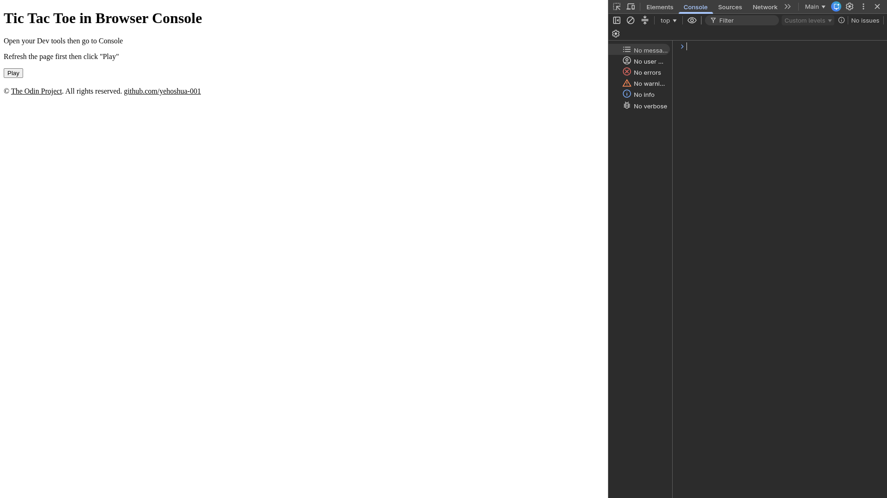
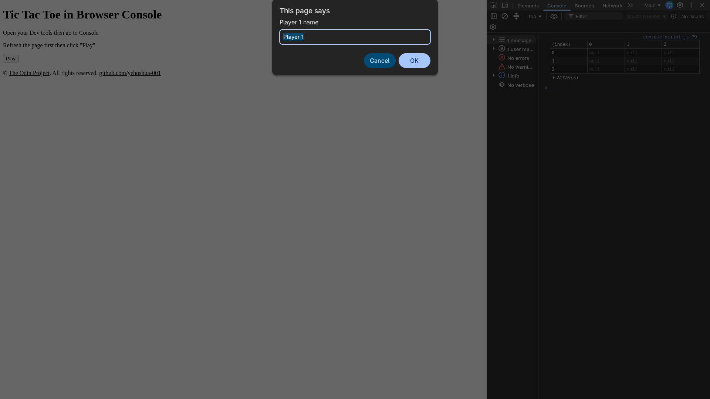
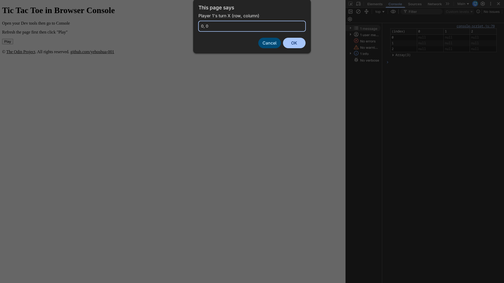
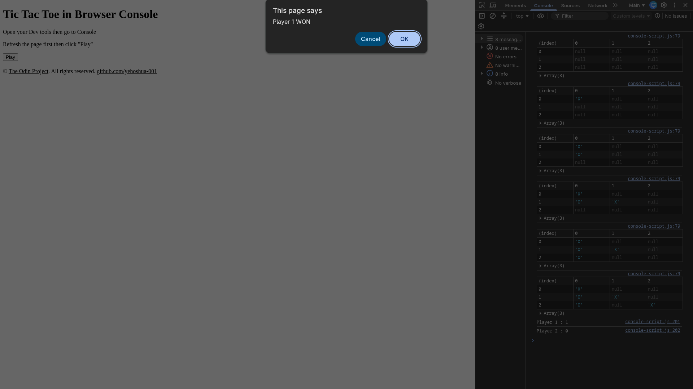

# Project: Tic Tac Toe | The Odin Project

## Description
This project is a web-based Tic Tac Toe game that functions inside multiple factory functions for closures and encapsulations to handle such objects. The purpose of this project is to demonstrate the lessons I learned in [Factory Functions and Module Pattern](https://www.theodinproject.com/lessons/node-path-javascript-factory-functions-and-the-module-pattern) which includes several methodologies in organizing code.

Particularly, this is the Browser Console version of the said project. The purpose and reason that I kept this version or branch of the project is for future learners or people trying to get into the field of JavaScript programming &mdash; to study and to understand "how to build something from inside out?", meaning you as a dev, sometimes you got to make it work in console first before making the user interface. Specifically in web browser console, because when I was studying and trying to understand how to do it, I find the resources limited and most of them were made for NodeJS topic which I have not study yet as I am writing this.

## Sample Images
 

 

 

 

 

 ## Access
 1. Clone the repository
 2. Open the console-version/ directory
 3. Open index.html in your browser
 